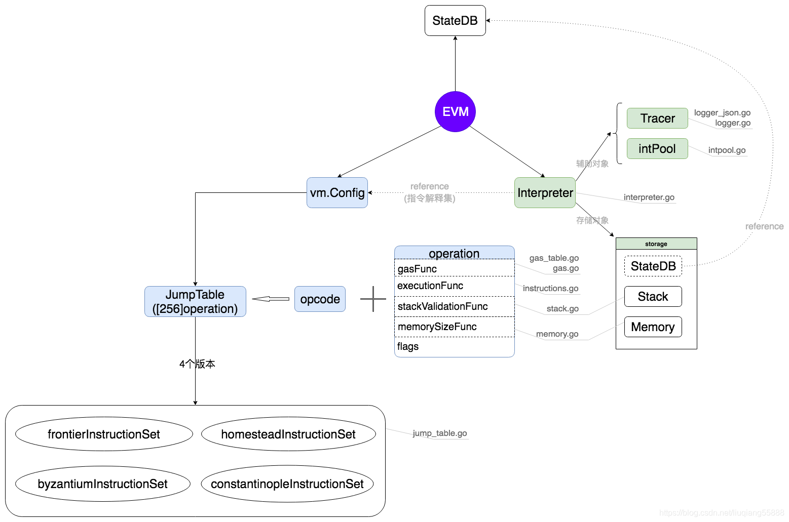

# 结构与流程
## 2020年版本的evm结构


## 大致流程
编写合约 > 生成abi > 解析abi得出指令集 > 指令通过opcode来映射成操作码集 > 生成一个operation[256]

## 以太坊虚拟机的工作流程：
由solidity语言编写的智能合约，通过编译器编译成bytecode，之后发到以太坊上，以太坊底层通过evm模块支持合约的执行和调用，调用时根据合约获取代码，即合约的字节码，生成环境后载入到 EVM 执行。

# 源码解析
## opcodes.go
文件`opcodes.go`中定义了所有的OpCode，该值是一个byte，合约编译出来的bytecode中，一个OpCode就是上面的一位。opcodes按功能分为9组，以第一位十六进制数来分类，例如0x1x,0x2x。

例如第一组为 算术 操作
```go
// 0x0 range - arithmetic ops.
const (
	STOP       OpCode = 0x0
	ADD        OpCode = 0x1
	MUL        OpCode = 0x2
	SUB        OpCode = 0x3
	DIV        OpCode = 0x4
	SDIV       OpCode = 0x5
	MOD        OpCode = 0x6
	SMOD       OpCode = 0x7
	ADDMOD     OpCode = 0x8
	MULMOD     OpCode = 0x9
	EXP        OpCode = 0xa
	SIGNEXTEND OpCode = 0xb
)
```

可以使用表格来总结

|opCodeRange|对应操作|
|---|---|
|0x0	|算术操作|
|0x10	|比较操作|
|0x20	|加密操作|
|0x30	|状态闭包|
|0x40	|区块操作|
|0x50	|存储和执行操作|
|0x60	|压栈操作|
|0x80	|克隆操作|
|0x90	|交换操作|
|0xa0	|日志操作|
|0xf0	|闭包|

实现了判断能否压栈、操作码的byte类型和string类型互相转换的函数或接口。

core/vm/opcodes.go
```go
func StringToOp(str string) OpCode  
func (op OpCode) String() string  
func (op OpCode) IsPush() bool
```

common/types.go
```go
AddressLength = 20
HashLength = 32
type Address [AddressLength]byte
type bitvec [ ]byte
// Hash represents the 32 byte Keccak256 hash of arbitrary data.
type Hash [HashLength]byte
```

## contract.go
### 合约的结构
```go
// Contract代表状态数据库中的以太坊合约。它包含
// 合约代码，调用参数。Contract实现了ContractRef
type Contract struct {
	// CallerAddress是初始化这个
	// 合约的调用者的结果。然而，当"call方法"被委托时，这个值
	// 需要被初始化为调用者的调用者。
	CallerAddress common.Address
	caller        ContractRef
	self          ContractRef

	jumpdests map[common.Hash]bitvec // JUMPDEST分析的汇总结果。
	analysis  bitvec                 // JUMPDEST分析的本地缓存结果

	Code     []byte             // 代码字节数组
	CodeHash common.Hash
	CodeAddr *common.Address
	Input    []byte

	Gas   uint64
	value *big.Int
}
```

### 构造方法
```go
// NewContract 返回一个新的合约环境用于执行 EVM。
func NewContract(caller ContractRef, object ContractRef, value *big.Int, gas uint64) *Contract {
	c := &Contract{CallerAddress: caller.Address(), caller: caller, self: object}

	if parent, ok := caller.(*Contract); ok {
		// 如果可用，从父上下文复用 JUMPDEST 分析。
		c.jumpdests = parent.jumpdests
	} else {
		c.jumpdests = make(map[common.Hash]bitvec)
	}

	// Gas 应该是一个指针，这样它可以在运行中安全地减少
	// 这个指针将会脱离状态转换
	c.Gas = gas
	// 确保设定一个值
	c.value = value

	return c
}
```
该函数构造了新的合约，且如果是被合约调用，则复用该合约的 jumpdests

### validJumpdest
检验代码跳转是否合法
```go
func (c *Contract) validJumpdest(dest *uint256.Int) bool {
    // 返回dest低64位，并返回一个布尔值，表示是否发生了溢出。
	udest, overflow := dest.Uint64WithOverflow()
	// 程序计数器不能超过代码的长度，当然也不能大于63位。
	// 在这种情况下，不需要检查JUMPDEST。
	if overflow || udest >= uint64(len(c.Code)) {
		return false
	}
	// 只允许JUMPDEST作为目的地
	if OpCode(c.Code[udest]) != JUMPDEST {
		return false
	}
	return c.isCode(udest)
}
```

```go
// 如果提供的PC位置是一个实际的操作码，而不是PUSHN操作后的数据段，
// 那么它会返回true。
func (c *Contract) isCode(udest uint64) bool {
	// 我们已经有一个分析了吗？
	if c.analysis != nil {
		return c.analysis.codeSegment(udest)
	}
	// 我们已经有一个合约哈希了吗？
	// 如果我们有哈希，那就意味着它是一个'常规'合约。对于常规
	// 合约（不是临时的initcode），我们在map中存储分析
	if c.CodeHash != (common.Hash{}) {
		// 父上下文是否有分析？
		analysis, exist := c.jumpdests[c.CodeHash]
		if !exist {
			// 进行分析并保存在父上下文中
			// 我们不需要将其存储在c.analysis中
			analysis = codeBitmap(c.Code)
			c.jumpdests[c.CodeHash] = analysis
		}
		// 也把它放在当前合约中以便更快地访问
		c.analysis = analysis
		return analysis.codeSegment(udest)
	}
	// 我们没有代码哈希，很可能是一段尚未在状态trie中的initcode。
	// 在这种情况下，我们进行分析，并本地保存，这样
	// 我们就不必为执行中的每一条JUMP指令重新计算
	// 但是，我们不会把它保存在父上下文中
	if c.analysis == nil {
		c.analysis = codeBitmap(c.Code)
	}
	return c.analysis.codeSegment(udest)
}
```

### AsDelegate
`AsDelegate`将合约设置为委托调用并返回当前合同（用于链式调用）
```go
// AsDelegate 将合约设置为委托调用并返回当前合约（用于链式调用）
func (c *Contract) AsDelegate() *Contract {
	// 注意：调用者必须始终是一个合约。调用者不应该是除合约之外的其他东西。
	parent := c.caller.(*Contract)
	c.CallerAddress = parent.CallerAddress
	c.value = parent.value

	return c
}
```

## stack.go
为了应对高并发情况下的栈资源问题，代码中创建了 栈池 来保存一些被创造但未使用的栈空间。
```go
var stackPool = sync.Pool{
	New: func() interface{} {
		return &Stack{data: make([]uint256.Int, 0, 16)}
	},
}
```

## memory.go
### 数据结构
```go
// Memory 为以太坊虚拟机实现了一个简单的内存模型。
type Memory struct {
	store       []byte // 存储
	lastGasCost uint64 // 上一次的燃气费用
}
```

为以太坊虚拟机提供一个简单存储的模型
```go
func (m *Memory) Set(offset, size uint64, value []byte) 
func (m *Memory) Set32(offset uint64, val *uint256.Int) 
func (m *Memory) Resize(size uint64)
func (m *Memory) GetCopy(offset, size int64) (cpy []byte)  // 截取切片中的一段 (offset,offset+size)
func (m *Memory) GetPtr(offset, size int64)  // 返回切片中的一段的指针
func (m *Memory) Len() int
func (m *Memory) Data() []byte
```

## memory_table.go
衡量一些操作所消耗的内存大小同时判断是否会发生栈溢出，如keccak256、callDataCopy、MStore等

## EVM.go
### EVM结构
`EVM` 是以太坊虚拟机基础对象，提供工具处理对应上下文中的交易。运行过程中一旦发生错误，状态会回滚并且不退还gas费用，运行中产生的任务错误都会被归结为代码错误。
```go
// EVM是以太坊虚拟机的基础对象，提供了在给定状态下运行合约所需的工具，
// 并提供了相应的上下文。需要注意的是，任何通过调用生成的错误都应被视为
// 一种回滚状态并消耗所有气体的操作，不应进行任何特定错误的检查。
// 解释器确保任何生成的错误都被视为错误的代码。
//
// EVM永远不应被重用，且不是线程安全的。
type EVM struct {
	// Context提供辅助的区块链相关信息
	Context BlockContext
	TxContext
	// StateDB提供访问底层状态的权限
	StateDB StateDB
	// Depth是当前的调用堆栈
	depth int

	// chainConfig包含了当前链的信息
	chainConfig *params.ChainConfig
	// chain rules包含了当前时代的链规则
	chainRules params.Rules
	// 用于初始化evm的虚拟机配置选项
	Config Config
	// 全局的（在此上下文中）以太坊虚拟机
	// 在整个交易执行过程中使用。
	interpreter *EVMInterpreter
	// abort用于中止EVM调用操作
	abort atomic.Bool
	// callGasTemp保存当前调用可用的gas。这是必要的，因为
	// 可用的gas是按照63/64规则在gasCall*中计算的，然后在opCall*中应用。
	callGasTemp uint64
}
```

#### 区块上下文 BlockContext
前三个变量为函数类型，依次作用为 查询转账者账户是否有充足ether支持转账操作、转账操作、获取第n个区块的hash

其余为一些基础的区块信息，如币基交易地址、Gaslimit、区块高、时间戳、难度值和基础费用

区块一旦创建，区块信息不可以被修改
```go
// BlockContext为EVM提供辅助信息。一旦提供，就不应该修改。
type BlockContext struct {
	// CanTransfer返回账户是否包含足够的以太币进行转账
	CanTransfer CanTransferFunc
	// Transfer从一个账户转移以太币到另一个账户
	Transfer TransferFunc
	// GetHash返回对应于n的哈希
	GetHash GetHashFunc

	// 区块信息
	Coinbase    common.Address // 提供COINBASE的信息
	GasLimit    uint64         // 提供GASLIMIT的信息
	BlockNumber *big.Int       // 提供NUMBER的信息
	Time        uint64         // 提供TIME的信息
	Difficulty  *big.Int       // 提供DIFFICULTY的信息
	BaseFee     *big.Int       // 提供BASEFEE的信息
	Random      *common.Hash   // 提供PREVRANDAO的信息
}
```

#### 交易上下文 TxContext
```go
// TxContext为EVM提供关于交易的信息。
// 所有字段在交易之间都可能发生变化。
type TxContext struct {
	// 消息信息
	Origin     common.Address // 提供ORIGIN的信息
	GasPrice   *big.Int       // 提供GASPRICE的信息
	BlobHashes []common.Hash  // 提供BLOBHASH的信息
}
```

Origin是什么？就是第一个交易

### evm方法
#### 创建evm
只能用一次
```go
// NewEVM 返回一个新的 EVM。返回的 EVM 不是线程安全的，应该
// 只被使用*一次*。
func NewEVM(blockCtx BlockContext, txCtx TxContext, statedb StateDB, chainConfig *params.ChainConfig, config Config) *EVM {
	evm := &EVM{
		Context:     blockCtx,
		TxContext:   txCtx,
		StateDB:     statedb,
		Config:      config,
		chainConfig: chainConfig,
		chainRules:  chainConfig.Rules(blockCtx.BlockNumber, blockCtx.Random != nil, blockCtx.Time),
	}
	evm.interpreter = NewEVMInterpreter(evm)
	return evm
}
```

#### Reset
```go
// Reset用新的交易上下文重置EVM。这不是线程安全的，应非常谨慎地执行。
func (evm *EVM) Reset(txCtx TxContext, statedb StateDB) {
	evm.TxContext = txCtx
	evm.StateDB = statedb
}
```

#### Cancel & Cancelled
能够通过原子的修改abort使得取消任何evm操作
```go
// Cancel 取消任何正在运行的 EVM 操作。这个方法可以被并发调用，
// 并且多次调用是安全的。
func (evm *EVM) Cancel() {
	evm.abort.Store(true)
}

// Cancelled 如果 Cancel 方法被调用过，那么返回 true
func (evm *EVM) Cancelled() bool {
	return evm.abort.Load()
}
```

### 执行交易过程
同步一个新的区块准备插入本地BlockChain之前需要重放并执行新区块的所有交易，并产生交易收据和日志。以太坊是如何执行这些交易呢？这就要请出大名鼎鼎的以太坊虚拟机。

以太坊虚拟机在执行交易分为两个部分
1. 第一部分是创建EVM，计算交易金额，设置交易对象，计算交易gas花销；
2. 第二部分是EVM 的虚拟机解析器通过合约指令，执行智能合约代码，具体来看看源码。

#### 创建EVM，通过EVM执行交易流程
BlockChain调用 `processor.Process()` 遍历block的所有交易，然后调用：
```go
receipt, err := applyTransaction(msg, p.config, gp, statedb, blockNumber, blockHash, tx, usedGas, vmenv)
```

执行交易并返回收据数据
```go
// ApplyTransaction尝试将交易应用到给定的状态数据库
// 并使用输入参数作为其环境。它返回交易的收据，
// 已使用的gas和如果交易失败的错误，
// 表明区块是无效的。
func ApplyTransaction(config *params.ChainConfig, bc ChainContext, author *common.Address, gp *GasPool, statedb *state.StateDB, header *types.Header, tx *types.Transaction, usedGas *uint64, cfg vm.Config) (*types.Receipt, error) {
	msg, err := TransactionToMessage(tx, types.MakeSigner(config, header.Number, header.Time), header.BaseFee)
	if err != nil {
		return nil, err
	}
	// 创建一个新的上下文以在EVM环境中使用
	blockContext := NewEVMBlockContext(header, bc, author)
	vmenv := vm.NewEVM(blockContext, vm.TxContext{}, statedb, config, cfg)
	return applyTransaction(msg, config, gp, statedb, header.Number, header.Hash(), tx, usedGas, vmenv)
}

func applyTransaction(msg *Message, config *params.ChainConfig, gp *GasPool, statedb *state.StateDB, blockNumber *big.Int, blockHash common.Hash, tx *types.Transaction, usedGas *uint64, evm *vm.EVM) (*types.Receipt, error) {
	// 在EVM环境中创建一个新的上下文
	txContext := NewEVMTxContext(msg)
	evm.Reset(txContext, statedb)

	// 将交易应用到当前状态（包含在环境中）
	result, err := ApplyMessage(evm, msg, gp)
	if err != nil {
		return nil, err
	}

	// 使用待处理的更改更新状态
	var root []byte
	if config.IsByzantium(blockNumber) {
		statedb.Finalise(true)
	} else {
		root = statedb.IntermediateRoot(config.IsEIP158(blockNumber)).Bytes()
	}
	*usedGas += result.UsedGas

	// 为交易创建一个新的收据，存储中间状态根和交易使用的gas
	receipt := &types.Receipt{Type: tx.Type(), PostState: root, CumulativeGasUsed: *usedGas}
	if result.Failed() {
		receipt.Status = types.ReceiptStatusFailed
	} else {
		receipt.Status = types.ReceiptStatusSuccessful
	}
	receipt.TxHash = tx.Hash()
	receipt.GasUsed = result.UsedGas

	// 如果交易创建了一个合约，将创建地址存储在收据中
	if msg.To == nil {
		receipt.ContractAddress = crypto.CreateAddress(evm.TxContext.Origin, tx.Nonce())
	}

	// 设置收据日志并创建bloom过滤器
	receipt.Logs = statedb.GetLogs(tx.Hash(), blockNumber.Uint64(), blockHash)
	receipt.Bloom = types.CreateBloom(types.Receipts{receipt})
	receipt.BlockHash = blockHash
	receipt.BlockNumber = blockNumber
	receipt.TransactionIndex = uint(statedb.TxIndex())
	return receipt, err
}
```

1. 首先调用tx.Message()方法产生交易Message。这个方法通过txdata数据来拼接Message对象，并通过签名方法signer.Sender(tx)，对txdata 的V、R 、S三个数进行解密得到这个交易的签名公钥（也是就是发送方的地址）。发送方的地址在交易数据中是没有的，这主要是为了防止交易数据被篡改，任何交易数据的变化后通过signer.Sender方法都不能得到正确的地址。
2. 调用 `NewEVMBlockContext(header, bc, author)` 创建EVM的上下文环境，调用 `vm.NewEVM(blockContext, vm.TxContext{}, statedb, config, cfg)` 创建EVM对象，并在内部创建一个`evm.interpreter`（虚拟机解析器）。
3. 调用`ApplyMessage(evm, msg, gp)`方法通过EVM对象来执行Message。

重点看看`ApplyMessage()`方法的实现：
```go
// ApplyMessage 通过在环境中应用给定的消息来计算新的状态
// 对旧的状态进行操作。
//
// ApplyMessage 返回任何EVM执行（如果发生）返回的字节，
// 使用的气体（包括气体退款）和一个错误，如果它失败了。错误始终
// 表示一个核心错误，这意味着该消息对于那个特定
// 的状态总是会失败，永远不会被接受在一个块内。
func ApplyMessage(evm *vm.EVM, msg *Message, gp *GasPool) (*ExecutionResult, error) {
	return NewStateTransition(evm, msg, gp).TransitionDb()
}
```

创建 `stateTransition` 对象，执行 `TransitionDb()` 方法：
```go
// TransitionDb将通过应用当前消息来改变状态，并返回以下字段的EVM执行结果。
//
//   - 已使用的gas：总共使用的gas（包括正在退款的gas）
//   - 返回数据：来自EVM的返回数据
//   - 具体执行错误：中断执行的各种EVM错误，例如
//     ErrOutOfGas，ErrExecutionReverted
//
// 但是，如果遇到任何共识问题，则直接返回错误，并返回
// nil EVM执行结果。
func (st *StateTransition) TransitionDb() (*ExecutionResult, error) {
	// 首先检查此消息是否在应用消息之前满足所有共识规则。规则包括以下条款：
	//
	// 1. 消息调用者的nonce是正确的
	// 2. 调用者有足够的余额来支付交易费用（gaslimit * gasprice）
	// 3. 所需的gas量在块中是可用的
	// 4. 购买的gas足以覆盖内在使用
	// 5. 计算内在gas时没有溢出
	// 6. 调用者有足够的余额来覆盖**最顶层**调用的资产转移

	// 检查条款1-3，如果一切正确，则购买gas
	if err := st.preCheck(); err != nil {
		return nil, err
	}

	if tracer := st.evm.Config.Tracer; tracer != nil {
		tracer.CaptureTxStart(st.initialGas)
		defer func() {
			tracer.CaptureTxEnd(st.gasRemaining)
		}()
	}

	var (
		msg              = st.msg
		sender           = vm.AccountRef(msg.From)
		rules            = st.evm.ChainConfig().Rules(st.evm.Context.BlockNumber, st.evm.Context.Random != nil, st.evm.Context.Time)
		contractCreation = msg.To == nil
	)

	// 检查条款4-5，如果一切正确，则减去内在gas
	gas, err := IntrinsicGas(msg.Data, msg.AccessList, contractCreation, rules.IsHomestead, rules.IsIstanbul, rules.IsShanghai)
	if err != nil {
		return nil, err
	}
	if st.gasRemaining < gas {
		return nil, fmt.Errorf("%w: have %d, want %d", ErrIntrinsicGas, st.gasRemaining, gas)
	}
	st.gasRemaining -= gas

	// 检查条款6
	if msg.Value.Sign() > 0 && !st.evm.Context.CanTransfer(st.state, msg.From, msg.Value) {
		return nil, fmt.Errorf("%w: address %v", ErrInsufficientFundsForTransfer, msg.From.Hex())
	}

	// 检查初始化代码大小是否已超过。
	if rules.IsShanghai && contractCreation && len(msg.Data) > params.MaxInitCodeSize {
		return nil, fmt.Errorf("%w: code size %v limit %v", ErrMaxInitCodeSizeExceeded, len(msg.Data), params.MaxInitCodeSize)
	}

	// 执行状态转换的准备步骤，包括：
	// - 准备访问列表（post-berlin）
	// - 重置临时存储（eip 1153）
	st.state.Prepare(rules, msg.From, st.evm.Context.Coinbase, msg.To, vm.ActivePrecompiles(rules), msg.AccessList)

	var (
		ret   []byte
		vmerr error // vm错误不影响共识，因此不分配给err
	)
	if contractCreation {
		ret, _, st.gasRemaining, vmerr = st.evm.Create(sender, msg.Data, st.gasRemaining, msg.Value)
	} else {
		// 为下一次交易增加nonce
		st.state.SetNonce(msg.From, st.state.GetNonce(sender.Address())+1)
		ret, st.gasRemaining, vmerr = st.evm.Call(sender, st.to(), msg.Data, st.gasRemaining, msg.Value)
	}

	if !rules.IsLondon {
		// 在EIP-3529之前：退款被限制为gasUsed / 2
		st.refundGas(params.RefundQuotient)
	} else {
		// 在EIP-3529之后：退款被限制为gasUsed / 5
		st.refundGas(params.RefundQuotientEIP3529)
	}
	effectiveTip := msg.GasPrice
	if rules.IsLondon {
		effectiveTip = cmath.BigMin(msg.GasTipCap, new(big.Int).Sub(msg.GasFeeCap, st.evm.Context.BaseFee))
	}

	if st.evm.Config.NoBaseFee && msg.GasFeeCap.Sign() == 0 && msg.GasTipCap.Sign() == 0 {
		// 当NoBaseFee设置为0且费用字段为0时，跳过费用支付。
		// 这避免了在模拟调用时将负的effectiveTip应用到coinbase。
	} else {
		fee := new(big.Int).SetUint64(st.gasUsed())
		fee.Mul(fee, effectiveTip)
		st.state.AddBalance(st.evm.Context.Coinbase, fee)
	}

	return &ExecutionResult{
		UsedGas:    st.gasUsed(),
		Err:        vmerr,
		ReturnData: ret,
	}, nil
}
```

3.1 调用`IntrinsicGas()`方法，通过计算消息的大小以及是否是合约创建交易，来计算此次交易需消耗的gas。

3.2 如果`msg.to == nil`，则是合约创建交易，调用`st.evm.Create(sender, msg.Data, st.gasRemaining, msg.Value)`来执行message
```go
// Create使用代码作为部署代码创建新的合约。
func (evm *EVM) Create(caller ContractRef, code []byte, gas uint64, value *big.Int) (ret []byte, contractAddr common.Address, leftOverGas uint64, err error) {
	contractAddr = crypto.CreateAddress(caller.Address(), evm.StateDB.GetNonce(caller.Address()))
	return evm.create(caller, &codeAndHash{code: code}, gas, value, contractAddr, CREATE)
}

// Create2使用代码作为部署代码创建新的合约。
//
// Create2与Create的不同之处在于，Create2使用keccak256(0xff ++ msg.sender ++ salt ++ keccak256(init_code))[12:]
// 而不是通常的发送者和随机数哈希作为初始化合约的地址。
func (evm *EVM) Create2(caller ContractRef, code []byte, gas uint64, endowment *big.Int, salt *uint256.Int) (ret []byte, contractAddr common.Address, leftOverGas uint64, err error) {
	codeAndHash := &codeAndHash{code: code}
	contractAddr = crypto.CreateAddress2(caller.Address(), salt.Bytes32(), codeAndHash.Hash().Bytes())
	return evm.create(caller, codeAndHash, gas, endowment, contractAddr, CREATE2)
}

// create函数使用代码作为部署代码创建新的合约。
func (evm *EVM) create(caller ContractRef, codeAndHash *codeAndHash, gas uint64, value *big.Int, address common.Address, typ OpCode) ([]byte, common.Address, uint64, error) {
	// 执行深度检查。如果我们试图执行超过限制的代码，则失败。
	if evm.depth > int(params.CallCreateDepth) {
		return nil, common.Address{}, gas, ErrDepth
	}
	if !evm.Context.CanTransfer(evm.StateDB, caller.Address(), value) {
		return nil, common.Address{}, gas, ErrInsufficientBalance
	}
	// 获取nonce值
	nonce := evm.StateDB.GetNonce(caller.Address())
	// 检查nonce是否溢出
	if nonce+1 < nonce {
		return nil, common.Address{}, gas, ErrNonceUintOverflow
	}
	// 设置新的nonce值
	evm.StateDB.SetNonce(caller.Address(), nonce+1)
	// 在获取快照之前将地址添加到访问列表中。即使创建失败，访问列表的改变也不应该被回滚
	if evm.chainRules.IsBerlin {
		evm.StateDB.AddAddressToAccessList(address)
	}
	// 确保指定的地址没有现有的合约
	contractHash := evm.StateDB.GetCodeHash(address)
	if evm.StateDB.GetNonce(address) != 0 || (contractHash != (common.Hash{}) && contractHash != emptyCodeHash) {
		return nil, common.Address{}, 0, ErrContractAddressCollision
	}
	// 在状态中创建新账户
	snapshot := evm.StateDB.Snapshot()
	evm.StateDB.CreateAccount(address)
	if evm.chainRules.IsEIP158 {
		evm.StateDB.SetNonce(address, 1)
	}
	// 从调用者账户转账到新账户
	evm.Context.Transfer(evm.StateDB, caller.Address(), address, value)

	// 初始化一个新的合约并设置EVM要使用的代码。
	// 合约是此执行环境的范围环境。
	contract := NewContract(caller, AccountRef(address), value, gas)
	contract.SetCodeOptionalHash(&address, codeAndHash)

	// 如果存在追踪器，捕获开始和进入事件
	if evm.Config.Tracer != nil {
		if evm.depth == 0 {
			evm.Config.Tracer.CaptureStart(evm, caller.Address(), address, true, codeAndHash.code, gas, value)
		} else {
			evm.Config.Tracer.CaptureEnter(typ, caller.Address(), address, codeAndHash.code, gas, value)
		}
	}

	// 运行合约并获取结果
	ret, err := evm.interpreter.Run(contract, nil, false)

	// 检查是否超过了最大代码大小，如果是则赋值错误
	if err == nil && evm.chainRules.IsEIP158 && len(ret) > params.MaxCodeSize {
		err = ErrMaxCodeSizeExceeded
	}

	// 如果EIP-3541启用，拒绝以0xEF开头的代码。
	if err == nil && len(ret) >= 1 && ret[0] == 0xEF && evm.chainRules.IsLondon {
		err = ErrInvalidCode
	}

	// 如果合同创建成功运行且没有返回错误，则计算存储代码所需的气体。
	// 如果由于气体不足而无法存储代码，则设置一个错误，并让其由下面的错误检查条件处理。
	if err == nil {
		createDataGas := uint64(len(ret)) * params.CreateDataGas
		if contract.UseGas(createDataGas) {
			evm.StateDB.SetCode(address, ret)
		} else {
			err = ErrCodeStoreOutOfGas
		}
	}

	// 当EVM返回错误或在设置创建代码时，我们将恢复到快照并消耗剩余的任何气体。
	// 此外，当我们在家园时，这也适用于代码存储气体错误。
	if err != nil && (evm.chainRules.IsHomestead || err != ErrCodeStoreOutOfGas) {
		evm.StateDB.RevertToSnapshot(snapshot)
		if err != ErrExecutionReverted {
			contract.UseGas(contract.Gas)
		}
	}

	// 如果存在追踪器，捕获结束和退出事件
	if evm.Config.Tracer != nil {
		if evm.depth == 0 {
			evm.Config.Tracer.CaptureEnd(ret, gas-contract.Gas, err)
		} else {
			evm.Config.Tracer.CaptureExit(ret, gas-contract.Gas, err)
		}
	}
	return ret, address, contract.Gas, err
}
```

3.2.1 evm执行栈深度不能超过1024，发送方持有的以太坊数量大于此次合约交易金额。

3.2.2 对该发送方地址的nonce值+1，通过地址和nonce值生成合约地址，通过合约地址得到合约hash值。

3.2.3 记录一个状态快照，用来后见失败回滚。

3.2.4 为这个合约地址创建一个合约账户，并为这个合约账户设置nonce值为1

3.2.5 产生以太坊资产转移，发送方地址账户金额减value值，合约账户的金额加value值。

3.2.6 根据发送方地址和合约地址，以及金额value 值和gas，合约代码和代码hash值，创建一个合约对象

3.2.7 run方法来执行合约，内部调用evm的解析器来执行合约指令，如果是预编译好的合约，则预编译执行合约就行。

3.2.8 如果执行ok，setcode更新这个合约地址状态，设置usegas为创建合约的gas。如果执行出错，则回滚到之前快照状态，设置usegas为传入的合约gas。

3.3 如果不是新创建的合约，则调用 `st.evm.Call(sender, st.to(), msg.Data, st.gasRemaining, msg.Value)` 方法，同时更新发送方地址nonce值+1.
```go
// Call执行与addr关联的合同，并将给定输入作为参数。
// 它还处理所需的任何价值转移，并采取创建账户和在执行错误或失败的价值转移的情况下反转状态的必要步骤。
func (evm *EVM) Call(caller ContractRef, addr common.Address, input []byte, gas uint64, value *big.Int) (ret []byte, leftOverGas uint64, err error) {
	// 如果我们试图超过调用深度限制，则失败
	if evm.depth > int(params.CallCreateDepth) {
		return nil, gas, ErrDepth
	}
	// 如果我们试图转移超过可用余额，则失败
	if value.Sign() != 0 && !evm.Context.CanTransfer(evm.StateDB, caller.Address(), value) {
		return nil, gas, ErrInsufficientBalance
	}
	snapshot := evm.StateDB.Snapshot()
	p, isPrecompile := evm.precompile(addr)
	debug := evm.Config.Tracer != nil

	if !evm.StateDB.Exist(addr) {
		if !isPrecompile && evm.chainRules.IsEIP158 && value.Sign() == 0 {
			// 调用一个不存在的账户，不做任何事情，但是ping跟踪器
			if debug {
				if evm.depth == 0 {
					evm.Config.Tracer.CaptureStart(evm, caller.Address(), addr, false, input, gas, value)
					evm.Config.Tracer.CaptureEnd(ret, 0, nil)
				} else {
					evm.Config.Tracer.CaptureEnter(CALL, caller.Address(), addr, input, gas, value)
					evm.Config.Tracer.CaptureExit(ret, 0, nil)
				}
			}
			return nil, gas, nil
		}
		evm.StateDB.CreateAccount(addr)
	}
	evm.Context.Transfer(evm.StateDB, caller.Address(), addr, value)

	// 在调试模式下捕获跟踪器开始/结束事件
	if debug {
		if evm.depth == 0 {
			evm.Config.Tracer.CaptureStart(evm, caller.Address(), addr, false, input, gas, value)
			defer func(startGas uint64) { // 参数的延迟计算
				evm.Config.Tracer.CaptureEnd(ret, startGas-gas, err)
			}(gas)
		} else {
			// 处理进入和退出调用帧的跟踪器事件
			evm.Config.Tracer.CaptureEnter(CALL, caller.Address(), addr, input, gas, value)
			defer func(startGas uint64) {
				evm.Config.Tracer.CaptureExit(ret, startGas-gas, err)
			}(gas)
		}
	}

	if isPrecompile {
		ret, gas, err = RunPrecompiledContract(p, input, gas)
	} else {
		// 初始化一个新的合同并设置EVM将使用的代码。
		// 合同是这个执行上下文的范围环境。
		code := evm.StateDB.GetCode(addr)
		if len(code) == 0 {
			ret, err = nil, nil // gas不变
		} else {
			addrCopy := addr
			// 如果账户没有代码，我们可以在这里中止
			// 深度检查已经完成，预编译处理在上面
			contract := NewContract(caller, AccountRef(addrCopy), value, gas)
			contract.SetCallCode(&addrCopy, evm.StateDB.GetCodeHash(addrCopy), code)
			ret, err = evm.interpreter.Run(contract, input, false)
			gas = contract.Gas
		}
	}
	// 当EVM返回错误或设置创建代码时
	// 我们恢复到快照并消耗任何剩余的gas。另外
	// 当我们在家园时，这也适用于代码存储gas错误。
	if err != nil {
		evm.StateDB.RevertToSnapshot(snapshot)
		if err != ErrExecutionReverted {
			gas = 0
		}
		// TODO: 考虑清理未使用的快照:
		//} else {
		//	evm.StateDB.DiscardSnapshot(snapshot)
	}
	return ret, gas, err
}
```
evm.call方法和evm.create方法大致相同，我们来说说不一样的地方。

3.3.1 call方法调用的是一个存在的合约地址的合约，所以不用创建合约账户。如果call方法发现本地没有合约接收方的账户，则需要创建一个接收方的账户，并更新本地状态数据库。

3.3.2 create方法的资金transfer转移是在创建合约用户账户和这个合约账户之间发生，而call方法的资金转移是在合约的发送方和合约的接收方之间产生。

3.4 `TransitionDb()` 方法执行完合约，调用 `st.refundGas()` 方法计算合约退税，调用evm SSTORE指令 或者evm SUICIDE指令销毁合约十都会产生退税。

3.5 计算合约产生的gas总数，加入到矿工账户，作为矿工收入。

---

4 回到最开始的ApplyTransaction()方法，根据EVM的执行结果，拼接交易receipt数据，其中receipt.Logs日志数据是EVM执行指令代码的时候产生的，receipt.Bloom根据日志数据建立bloom过滤器。

## interpreter.go
### 数据结构
#### Config
解释器中会有一个配置结构体，能够选择debug模式，包含追踪操作码的evm日志，一些eip提议的配置，evm跳表
```go
// Config 是解释器的配置选项
type Config struct {
	Tracer                  EVMLogger // 操作码记录器
	NoBaseFee               bool      // 强制将 EIP-1559 的基础费用设为 0 (对于价格为0的调用需要)
	EnablePreimageRecording bool      // 启用 SHA3/keccak 预映像的记录
	ExtraEips               []int     // 需要启用的额外 EIPS
}
```

#### ScopeContext
```go
// ScopeContext 包含每次调用的内容，例如堆栈和内存，
// 但不包含像 pc 和 gas 这样的瞬态变量
type ScopeContext struct {
	Memory   *Memory     // 内存
	Stack    *Stack      // 堆栈
	Contract *Contract   // 合约
}
```

#### EVMInterpreter
解释器结构，包含evm指针，hasher，是否只读，返回数据信息
```go
// EVMInterpreter 代表一个 EVM 解释器
type EVMInterpreter struct {
	evm   *EVM              // EVM 实例
	table *JumpTable        // 跳转表

	hasher    crypto.KeccakState // Keccak256 哈希实例，跨操作码共享
	hasherBuf common.Hash        // Keccak256 哈希结果数组，跨操作码共享

	readOnly   bool   // 是否在状态修改时抛出异常
	returnData []byte // 上一次 CALL 的返回数据，供后续重用
}
```

### 方法
#### 构造方法
传入evm和配置信息构建新的解释器，根据配置信息设置该链的规则，如遵循eip158、eip150提议。
> `config` 包含在 `evm` 结构体中
```go
// NewEVMInterpreter 返回 Interpreter 的一个新实例。
func NewEVMInterpreter(evm *EVM) *EVMInterpreter {
	// 如果跳转表没有初始化，我们设置一个默认的。
	var table *JumpTable
	switch {
	case evm.chainRules.IsCancun:
		table = &cancunInstructionSet
	case evm.chainRules.IsShanghai:
		table = &shanghaiInstructionSet
	case evm.chainRules.IsMerge:
		table = &mergeInstructionSet
	case evm.chainRules.IsLondon:
		table = &londonInstructionSet
	case evm.chainRules.IsBerlin:
		table = &berlinInstructionSet
	case evm.chainRules.IsIstanbul:
		table = &istanbulInstructionSet
	case evm.chainRules.IsConstantinople:
		table = &constantinopleInstructionSet
	case evm.chainRules.IsByzantium:
		table = &byzantiumInstructionSet
	case evm.chainRules.IsEIP158:
		table = &spuriousDragonInstructionSet
	case evm.chainRules.IsEIP150:
		table = &tangerineWhistleInstructionSet
	case evm.chainRules.IsHomestead:
		table = &homesteadInstructionSet
	default:
		table = &frontierInstructionSet
	}
	var extraEips []int
	if len(evm.Config.ExtraEips) > 0 {
		// 对跳转表进行深拷贝以防止在其他表中修改操作码
		table = copyJumpTable(table)
	}
	for _, eip := range evm.Config.ExtraEips {
		if err := EnableEIP(eip, table); err != nil {
			// 禁用它，这样调用者可以检查它是否被激活
			log.Error("EIP激活失败", "eip", eip, "错误", err)
		} else {
			extraEips = append(extraEips, eip)
		}
	}
	evm.Config.ExtraEips = extraEips
	return &EVMInterpreter{evm: evm, table: table}
}
```

#### Run
```go
// 运行循环并使用给定的输入数据评估合约的代码，返回
// 返回的字节切片和一个错误（如果有的话）。
//
// 重要的是注意，解释器返回的任何错误都应该被
// 视为撤销并消耗所有燃气的操作，除非是
// ErrExecutionReverted表示撤销并保留剩余的燃气。
func (in *EVMInterpreter) Run(contract *Contract, input []byte, readOnly bool) (ret []byte, err error) {
	// 增加调用深度，限制为1024
	in.evm.depth++
	defer func() { in.evm.depth-- }()

	// 确保只有在我们还没有处于只读状态时才设置只读。
	// 这也确保了子调用不会删除只读标志。
	if readOnly && !in.readOnly {
		in.readOnly = true
		defer func() { in.readOnly = false }()
	}

	// 重置上一个调用的返回数据。保留旧缓冲区并不重要
	// 因为每个返回调用都会返回新的数据。
	in.returnData = nil

	// 如果没有代码，就不要执行。
	if len(contract.Code) == 0 {
		return nil, nil
	}

	var (
		op          OpCode        // 当前操作码
		mem         = NewMemory() // 绑定内存
		stack       = newstack()  // 本地栈
		callContext = &ScopeContext{
			Memory:   mem,
			Stack:    stack,
			Contract: contract,
		}
		// 出于优化的原因，我们使用uint64作为程序计数器。
		// 理论上可以超过2^64。YP将PC定义为uint256。实际上，这是不可能的。
		pc   = uint64(0) // 程序计数器
		cost uint64
		// 跟踪器使用的副本
		pcCopy  uint64 // 需要延迟的EVMLogger
		gasCopy uint64 // 为EVMLogger记录执行前剩余的燃气
		logged  bool   // 延迟的EVMLogger应忽略已经记录的步骤
		res     []byte // 操作码执行函数的结果
		debug   = in.evm.Config.Tracer != nil
	)
	// 不要移动这个延迟函数，它放在capturestate-deferred方法之前，
	// 所以它在执行之后：capturestate需要在返回到池之前的栈
	defer func() {
		returnStack(stack)
	}()
	contract.Input = input

	if debug {
		defer func() {
			if err != nil {
				if !logged {
					in.evm.Config.Tracer.CaptureState(pcCopy, op, gasCopy, cost, callContext, in.returnData, in.evm.depth, err)
				} else {
					in.evm.Config.Tracer.CaptureFault(pcCopy, op, gasCopy, cost, callContext, in.evm.depth, err)
				}
			}
		}()
	}
	// 解释器主运行循环（上下文）。这个循环运行直到显式的STOP, RETURN或SELFDESTRUCT被执行，
	// 在执行操作过程中出现错误，或者父上下文设置了done标志。
	for {
		if debug {
			// 捕获执行前的值以进行跟踪。
			logged, pcCopy, gasCopy = false, pc, contract.Gas
		}
		// 从跳转表中获取操作，并验证栈以确保有足够的栈项可用来执行操作。
		op = contract.GetOp(pc)
		operation := in.table[op]
		cost = operation.constantGas // 用于跟踪
		// 验证栈
		if sLen := stack.len(); sLen < operation.minStack {
			return nil, &ErrStackUnderflow{stackLen: sLen, required: operation.minStack}
		} else if sLen > operation.maxStack {
			return nil, &ErrStackOverflow{stackLen: sLen, limit: operation.maxStack}
		}
		if !contract.UseGas(cost) {
			return nil, ErrOutOfGas
		}
		if operation.dynamicGas != nil {
			// 所有具有动态内存使用的操作也具有动态燃气成本。
			var memorySize uint64
			// 计算新的内存大小并扩展内存以适应操作
			// 内存检查需要在评估动态燃气部分之前完成，以检测计算溢出
			if operation.memorySize != nil {
				memSize, overflow := operation.memorySize(stack)
				if overflow {
					return nil, ErrGasUintOverflow
				}
				// 内存以32字节的字扩展。燃气也以字计算。
				if memorySize, overflow = math.SafeMul(toWordSize(memSize), 32); overflow {
					return nil, ErrGasUintOverflow
				}
			}
			// 消耗燃气并在没有足够的燃气可用时返回错误。
			// cost被显式设置，以便capture state 延迟方法可以得到适当的成本
			var dynamicCost uint64
			dynamicCost, err = operation.dynamicGas(in.evm, contract, stack, mem, memorySize)
			cost += dynamicCost // 用于跟踪
			if err != nil || !contract.UseGas(dynamicCost) {
				return nil, ErrOutOfGas
			}
			// 在内存扩展之前进行跟踪
			if debug {
				in.evm.Config.Tracer.CaptureState(pc, op, gasCopy, cost, callContext, in.returnData, in.evm.depth, err)
				logged = true
			}
			if memorySize > 0 {
				mem.Resize(memorySize)
			}
		} else if debug {
			in.evm.Config.Tracer.CaptureState(pc, op, gasCopy, cost, callContext, in.returnData, in.evm.depth, err)
			logged = true
		}
		// 执行操作
		res, err = operation.execute(&pc, in, callContext)
		if err != nil {
			break
		}
		pc++
	}

	if err == errStopToken {
		err = nil // 清除停止标记错误
	}

	return res, err
}
```

我们直接看解析器处理的主循环，之前的代码都是在初始化一些临时变量。
1. 首先调用contract.GetOp(pc)从和约二进制数据里取得第pc个opcode，opcode是以太坊虚拟机指令，一共不超过256个，正好一个byte大小能装下。
2. 从解析器的JumpTable表中查到op对应的operation。比如opcode是SHA3（0x20），取到的operation就是
	```go
	SHA3: {
		execute:       opSha3,
		gasCost:       gasSha3,
		validateStack: makeStackFunc(2, 1),
		memorySize:    memorySha3,
		valid:         true,
	}
	```
	> execute表示指令对应的执行方法  
	> gasCost表示执行这个指令需要消耗的gas  
	> validateStack计算是不是解析器栈溢出  
	> memorySize用于计算operation的占用内存大小  
3. 如果operation可用，解析器栈不超过1024，且读写不冲突
4. 计算operation的memorysize，不能大于64位。
5. 根据不同的指令，指令的memorysize等，调用operation.gasCost()方法计算执行operation指令需要消耗的gas。
6. 调用operation.execute(&pc, in.evm, contract, mem, stack)执行指令对应的方法。
7. operation.reverts值是true或者operation.halts值是true的指令，会跳出主循环，否则继续遍历下个op。
8. operation指令集里面有4个特殊的指令LOG0，LOG1，LOG2，LOG3，它们的指令执行方法makeLog()会产生日志数据，这些日志数据会写入到tx的Receipt的logs里面，并存入本地ldb数据库。


## jump_table.go
### 数据结构
```go
type operation struct {
	// execute 是操作函数
	execute     executionFunc
	constantGas uint64
	dynamicGas  gasFunc
	// minStack 告诉我们需要多少堆栈项
	minStack int
	// maxStack 指定了此操作所能拥有的堆栈的最大长度，
	// 以防止堆栈溢出。
	maxStack int

	// memorySize 返回操作所需的内存大小
	memorySize memorySizeFunc
}
```

其中 `executionFunc` 有四处实现

instructions.go
```go
func makeLog(size int) executionFunc
func makePush(size uint64, pushByteSize int) executionFunc
func makeDup(size int64) executionFunc
func makeSwap(size int64) executionFunc
```

`memorySizeFunc` 的实现在memory_table.go文件中
```go
func memoryKeccak256(stack *Stack) (uint64, bool) {
	return calcMemSize64(stack.Back(0), stack.Back(1))
}

func memoryCallDataCopy(stack *Stack) (uint64, bool) {
	return calcMemSize64(stack.Back(0), stack.Back(2))
}

func memoryReturnDataCopy(stack *Stack) (uint64, bool) {
	return calcMemSize64(stack.Back(0), stack.Back(2))
}

func memoryCodeCopy(stack *Stack) (uint64, bool) {
	return calcMemSize64(stack.Back(0), stack.Back(2))
}

func memoryExtCodeCopy(stack *Stack) (uint64, bool) {
	return calcMemSize64(stack.Back(1), stack.Back(3))
}

func memoryMLoad(stack *Stack) (uint64, bool) {
	return calcMemSize64WithUint(stack.Back(0), 32)
}

func memoryMStore8(stack *Stack) (uint64, bool) {
	return calcMemSize64WithUint(stack.Back(0), 1)
}

func memoryMStore(stack *Stack) (uint64, bool) {
	return calcMemSize64WithUint(stack.Back(0), 32)
}

func memoryCreate(stack *Stack) (uint64, bool) {
	return calcMemSize64(stack.Back(1), stack.Back(2))
}
...
```

> Solidity的内存布局将前4个32字节的插槽保留
> - 0x00 - 0x3f (64bytes): 暂存空间(Scratch space)
> - 0x40 - 0x5f (32bytes): 空闲内存指针
> - 0x60 - 0x7f (32bytes): 0 插槽值
>
> 他们的作用分别是
> - 用来给hash方法和内联汇编使用
> - 记录当前已经分配的内存大小，空闲内存的起始值为0x80
> - 用作动态内存的初始值，不会被使用


jumpTable包含指向操作的指针
```go
// JumpTable包含了在给定分叉处支持的EVM操作码。
type JumpTable [256]*operation
```

检查jumpTable中的操作是否为空
```go
func validate(jt JumpTable) JumpTable {
	for i, op := range jt {
		if op == nil {
			panic(fmt.Sprintf("op %#x is not set", i))
		}
		// 解释器做了一个假设，即如果设置了memorySize函数，
		// 那么dynamicGas函数也会被设置。这是一个有些随意的假设，
		// 如有需要，我们可以移除它 -- 但这样可以避免一个条件检查。
		// 只要我们的假设存在，这个小的健壮性检查就可以防止我们合并违反这个假设的更改。
		if op.memorySize != nil && op.dynamicGas == nil {
			panic(fmt.Sprintf("op %v has dynamic memory but not dynamic gas", OpCode(i).String()))
		}
	}
	return jt
}
```

### 源码
我们知道 `opCode`是代码的解释器，这里的`operation`就是`opCode`的解释器，`interpreter`中有一个`jumptable`，它包含了指向操作的指针，`jumptable`中的操作就是对应`opCode`的操作，但是在不同的`config`配置下，操作集合也会遵循不同的规则。

例如我们可以看看部分代码
```go
// newFrontierInstructionSet返回可以在前沿阶段执行的前沿指令
// newFrontierInstructionSet返回的是可以在frontier阶段执行的指令集。
func newFrontierInstructionSet() JumpTable {
	tbl := JumpTable{
		STOP: {
			execute:     opStop, // 执行停止操作
			constantGas: 0,
			minStack:    minStack(0, 0),
			maxStack:    maxStack(0, 0),
		},
		ADD: {
			execute:     opAdd, // 执行增加操作
			constantGas: GasFastestStep,
			minStack:    minStack(2, 1), 
			maxStack:    maxStack(2, 1), 
		},
		MUL: {
			execute:     opMul, // 执行乘法操作
			constantGas: GasFastStep, 
			minStack:    minStack(2, 1), 
			maxStack:    maxStack(2, 1), 
		},
		SUB: {
			execute:     opSub, // 执行减法操作
			constantGas: GasFastestStep, 
			minStack:    minStack(2, 1), 
			maxStack:    maxStack(2, 1), 
		},
		DIV: {
			execute:     opDiv, // 执行除法操作
			constantGas: GasFastStep, 
			minStack:    minStack(2, 1), 
			maxStack:    maxStack(2, 1), 
		},
		SDIV: {
			execute:     opSdiv, // 执行符号除法操作
			constantGas: GasFastStep, 
			minStack:    minStack(2, 1), 
			maxStack:    maxStack(2, 1), 
		},
		MOD: {
			execute:     opMod, // 执行模运算操作
			constantGas: GasFastStep, 
			minStack:    minStack(2, 1), 
			maxStack:    maxStack(2, 1), 
		},
        SELFDESTRUCT: {
			execute:    opSelfdestruct, // 执行自毁操作
			dynamicGas: gasSelfdestruct,
			minStack:   minStack(1, 0),
			maxStack:   maxStack(1, 0),
		},
	}

	// 用opUndefined填充所有未分配的插槽。
	// 对于表中的所有未定义的操作，都将其定义为opUndefined。
	for i, entry := range tbl {
		if entry == nil {
			tbl[i] = &operation{execute: opUndefined, maxStack: maxStack(0, 0)}
		}
	}

	return validate(tbl) // 验证表
}
```

## instructions.go
指令集合，封装了操作指定过程中的堆栈操作。

## gas.go
根据是否遵循EIP150，返回实际的调用产生的费用
```go
// Gas costs
const (
	GasQuickStep   uint64 = 2
	GasFastestStep uint64 = 3
	GasFastStep    uint64 = 5
	GasMidStep     uint64 = 8
	GasSlowStep    uint64 = 10
	GasExtStep     uint64 = 20
)

// callGas返回调用的实际气体成本。
//
// 在家园价格变更HF期间，气体成本发生了变化。
// 作为EIP 150（TangerineWhistle）的一部分，返回的气体是气体 - 基础 * 63 / 64。
func callGas(isEip150 bool, availableGas, base uint64, callCost *uint256.Int) (uint64, error) {
	if isEip150 {
		availableGas = availableGas - base
		gas := availableGas - availableGas/64
		// 如果比特长度超过64位，我们知道新计算的EIP150的"气体"
		// 小于请求的数量。因此，我们返回新的气体，而不是
		// 返回错误。
		if !callCost.IsUint64() || gas < callCost.Uint64() {
			return gas, nil
		}
	}
	if !callCost.IsUint64() {
		return 0, ErrGasUintOverflow
	}

	return callCost.Uint64(), nil
}
```

## gas_table.go
一些操作的gas值计算，如自毁、Call、Callcode、delegateCall、staticCall、内存存储等，如：
```go
// memoryGasCost 计算内存扩展的二次气体。它只对
// 扩展的内存区域进行计算，而不是总内存。
func memoryGasCost(mem *Memory, newMemSize uint64) (uint64, error) {
	if newMemSize == 0 {
		return 0, nil
	}
	// 最大的可以放入 uint64 的是 max_word_count - 1。任何超过
	// 这个将导致溢出。另外，如果新的内存大小导致
	// newMemSizeWords 大于 0xFFFFFFFF 将会导致平方操作
	// 溢出。常数 0x1FFFFFFFE0 是可以使用的最大数字，
	// 不会导致气体计算溢出。
	if newMemSize > 0x1FFFFFFFE0 {
		return 0, ErrGasUintOverflow
	}
	newMemSizeWords := toWordSize(newMemSize)
	newMemSize = newMemSizeWords * 32

	if newMemSize > uint64(mem.Len()) {
		square := newMemSizeWords * newMemSizeWords
		linCoef := newMemSizeWords * params.MemoryGas
		quadCoef := square / params.QuadCoeffDiv
		newTotalFee := linCoef + quadCoef

		fee := newTotalFee - mem.lastGasCost
		mem.lastGasCost = newTotalFee

		return fee, nil
	}
	return 0, nil
}
```

## contracts.go
存放预编译好的合约

### 合约预编译的作用
预编译合约是 EVM 中用于提供更复杂库函数(通常用于加密、散列等复杂操作)的一种折衷方法，这些函数不适合编写操作码。 它们适用于简单但经常调用的合约，或逻辑上固定但计算量很大的合约。 预编译合约是在使用节点客户端代码实现的，因为它们不需要 EVM，所以运行速度很快。 与使用直接在 EVM 中运行的函数相比，它对开发人员来说成本也更低。


### evm调用contract的步骤
- 判断调用深度是否大于1024
- 判断是否有充足的余额支持调用
- 进行快照和预编译
- 检查该地址是否在状态数据库中存在
- 若不存在，调用一个不存在的帐户，不要做任何事情，只需ping跟踪程序，检查是否是debug模式，若不是则会创建账户
- 判断是否预编译，若是调用节点客户端代码实现；反之，创建合约对象并加载被调用地址和地址的hash以及代码信息，后用解释器来运行
- 若运行过程中有任何错误，则状态将会回滚到操作前快照处，并消耗gas

> evm调用深度 <= 1024

### 以太坊中的调用call、callcode和delegatecall
|调用方式	|修改的storage	|调用者的msg.sender	|被调用者的msg.sender	|执行的上下文|
|---|---|---|---|---|
|call	|被调用者的storage	|交易发起者的地址	|调用者的地址	|被调用者|
|callcode	|调用者的storage	|调用者的地址	|调用者的地址	|调用者|
|delegatecall	|调用者的storage	|交易发起者的地址	|调用者的地址	|调用者|

还有staticCall调用过程中不允许进行任何修改操作，可以用view来修饰，因此在函数实现中会给解释器的运行函数中的read-only参数传入true值。

## common.go
存放常用工具方法
```go
func calcMemSize64(off, l *uint256.Int) (uint64, bool) 
func getData(data []byte, start uint64, size uint64) []byte 
func toWordSize(size uint64) uint64
func allZero(b []byte) bool
```

计算内存空间是否溢出、根据给的参数返回数据切片、 返回内存扩展所需的字的大小、判断是否全0

## eips.go
实现了许多eip协议的配置函数，可以通过函数的方式使能跳转表，使其能够遵循某个eip规则。

## interface.go
包含stateDB、CallContext两种接口，


