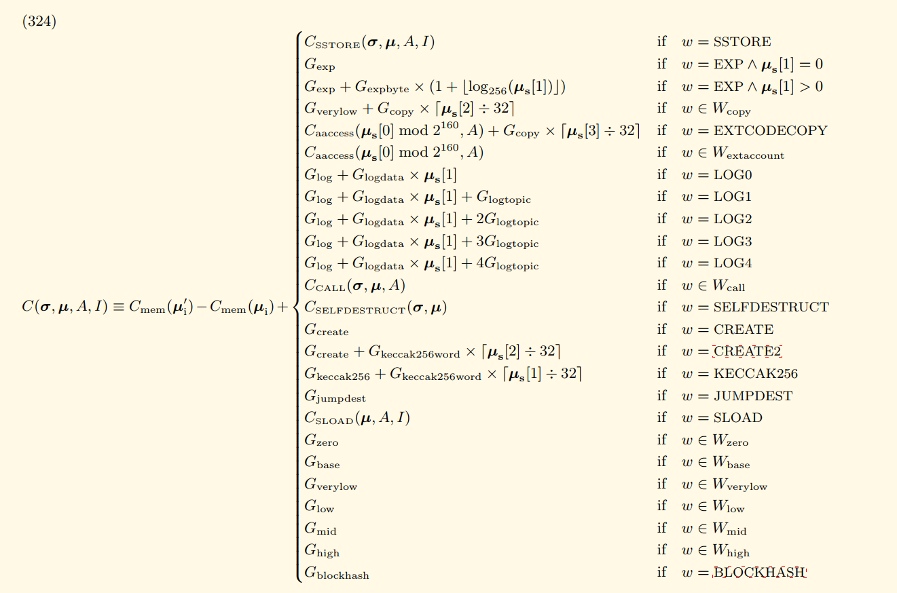

## 执行模型
执行模型指定了在一系列字节码指令和一小组环境数据的情况下，系统状态如何改变。这是通过一个虚拟状态机的形式模型来指定的，被称为以太坊虚拟机（EVM）。它是一台准图灵完备的机器；准完备是因为计算在本质上受到一个名为gas的参数的限制，该参数限制了总计算量。

### 9.1. 基础知识
EVM是一种简单的基于堆栈的架构。机器的字长（以及堆栈项的大小）为256位。这是为了便于Keccak-256哈希方案和椭圆曲线计算而选择的。内存模型是一个简单的字寻址字节数组。堆栈的最大大小为1024。该机器还有一个独立的存储模型；这类似于内存，但不是字节数组，而是字寻址的字数组。与内存不同，存储是非易失性的，并作为系统状态的一部分进行维护。存储和内存中的所有位置在初始状态下都被定义为零。

该机器不遵循标准的冯·诺伊曼体系结构。它不是将程序代码存储在通常可访问的内存或存储器中，而是单独存储在一个只能通过专门的指令进行交互的虚拟只读存储器中。

该机器可能因为多种原因而出现异常执行，包括堆栈下溢和无效指令。与燃尽气体异常一样，它们不会保留状态更改。相反，该机器立即停止并将问题报告给执行代理（事务处理器或递归地生成的执行环境），后者将单独处理该问题。

### 9.2. 费用概述
费用（以gas计量）在三种不同情况下收取，这三种情况都是操作执行的先决条件。第一种也是最常见的是与操作的计算本质相关的费用（请参见附录G）。其次，为了形成下属消息调用或合约创建的付款，可以扣除gas；这是CREATE、CREATE2、CALL和CALLCODE的一部分付款。最后，由于内存使用量的增加，可能需要支付gas。

在一个账户的执行过程中，内存使用费的总费用与最小的32字节的倍数成比例，以包括所有内存索引（无论是读还是写）在范围内。这是按需支付的；因此，引用一个内存区域，其大小至少比先前索引的任何内存大32字节，肯定会导致额外的内存使用费用。由于这个费用，地址很难超过32位的边界。尽管如此，实现必须能够处理这种情况。

存储费用具有稍微微妙的行为|为了鼓励最小化存储的使用（这直接对应于所有节点上的更大状态数据库），清除存储中的条目的操作的执行费用不仅被免除，还给予了一个有资格的退款；实际上，这个退款是事先支付的，因为存储位置的初始使用成本远高于正常使用成本。

有关EVM gas成本的严格定义，请参见附录H。

### 9.3. 执行环境
除了系统状态 σ、计算剩余的 gas g 和已累积的子状态 A 外，执行环境中还有一些重要的信息，执行代理必须提供这些信息，它们包含在元组 I 中：
- ${I_a}$，正在执行代码的账户的地址。
- ${I_o}$，发起此执行的交易的发送者地址。
- ${I_p}$，发起此执行的交易中的气价。
- ${I_d}$，作为此执行的输入数据的字节数组；如果执行代理是一个交易，则为交易数据。
- ${I_s}$，导致代码执行的账户的地址；如果执行代理是一个交易，则为交易发送者。
- ${I_v}$，以 Wei 为单位传递给此账户作为执行一部分的价值；如果执行代理是一个交易，则为交易的价值。
- ${I_b}$，要执行的机器代码的字节数组。
- ${I_H}$，当前区块的区块头。
- ${I_e}$，当前消息调用或合约创建的深度（即当前正在执行的 CALL 或 CREATE(2) 的数量）。
- ${I_w}$，对状态进行修改的权限。

执行模型定义了函数 Ξ，可以根据这些定义计算出结果状态 ${σ'}$、剩余 gas ${g'}$、结果子状态 ${A'}$ 和结果输出 ${o}$。在当前上下文中，我们将其定义为：

$(134)$ 
&emsp;&emsp;&emsp;&emsp;&emsp;&emsp;&emsp;&emsp;&emsp;&emsp;&emsp;&emsp;&emsp;
$(σ'; g'; A'; o) ≡ Ξ(σ; g; A; I)$

我们将记住，A，即累积子状态，在第6.1节中被定义。

### 9.4. 执行概述
我们现在必须定义Ξ函数。在大多数实际实现中，这将被建模为对完整系统状态 $σ$ 和机器状态 $µ$ 的迭代进展的级联。形式上，我们使用一个函数X来递归地定义它。这个函数使用一个迭代器函数 $O$（定义状态机的单个周期的结果），以及函数 $Z$ 来确定当前状态是否是机器的异常停止状态，以及函数H来指定只有当前状态是机器的正常停止状态时的指令输出数据。

空序列，表示为$()$，与空集，表示为 $Ø$，不相等；当解释 $H$ 的输出时，这一点很重要，当执行需要终止时，$H$ 的输出计算为 $Ø$ ，但当执行应该停止时，它计算为一系列（可能为空）。

请注意，在评估Ξ时，我们丢弃第四个元素 $I'$，并从结果机器状态 $µ'$ 中提取剩余的gas $µ_g'$。

因此，$X$ 被循环（在这里是递归的，但实现通常预期使用简单的迭代循环），直到 $Z$ 变为真，表示当前状态是异常的并且机器必须停止并且丢弃任何更改，或者直到 $H$ 变为一系列（而不是空集），表示机器已达到受控停止。

## 虚拟机规范
将256位二进制值解释为整数时，表示采用大端字节序。

当将256位机器数据转换为160位地址或哈希值时，使用右侧（对于大端字节序而言是低位）的20个字节，左侧的12个字节被丢弃或填充为零，因此整数值（当将字节解释为大端字节序时）是等效的。

### 1. Gas Cost 
一般的Gas Cost函数C定义如下：

其中， ${C_{CALL}}$ 、 ${C_{SELFDESTRUCT}}$ 、 ${C_{SLOAD}}$ 和 ${C_{SSTORE}}$ 的定义如下所述。我们定义以下指令的子集：

请注意内存成本部分，它是 ${G_{memory}}$ 和当前单词数目 ${µ_i}$ 与 0 及其向上取整的乘积。这样，无论是读取还是写入，所有访问都必须引用有效的内存。这些访问必须针对非零字节数。

引用零长度范围（例如，尝试将其作为CALL的输入范围传递）不需要将内存扩展到范围的开头。 ${µ_i'}$ 被定义为活动内存的新最大单词数；在这两者不相等的情况下给出特例。

请注意， ${C_{mem}}$ 是内存成本函数（扩展函数是成本之前和之后的差异）。它是一个多项式，高阶系数被除以并向下取整，因此在使用的内存达到704B之前是线性的，之后成本大幅增加。
在定义指令集时，我们定义了范围函数 ${M}$ 的内存扩展，如下：

另一个有用的函数是"除了一个64分之一"的函数 ${L}$ ，定义如下：

### 指令集。
如前所述，在第9节中，这些定义发生在那里的最终上下文中。特别是，我们假设 $O$ 是EVM状态进展函数，并定义与下一个周期状态 $（σ',µ'）$ 相关的术语。

以下是根据第9节中给出的状态转换规则为每个指令指定的各种异常情况，以及J和C的额外指令特定定义。对于每个指令，还指定了α，即放置在堆栈上的额外项，以及δ，即从堆栈中移除的项，如第9节所定义。

#### 0s:停止和算术操作
除非另有说明，所有算术运算都是模 ${2^{256}}$ 运算。零的零次幂 ${0^0}$ 被定义为1。

#### 10s:比较和位逻辑操作

#### 20s:KECCAK256

#### 30s:环境信息

#### 40s: 块信息

#### 50s: 堆栈、内存、存储和流程操作

#### 60s & 70s: Push操作

#### 80s: 复制操作

#### 90s: 交换操作

#### a0s: 日志操作

#### f0s: 系统操作

