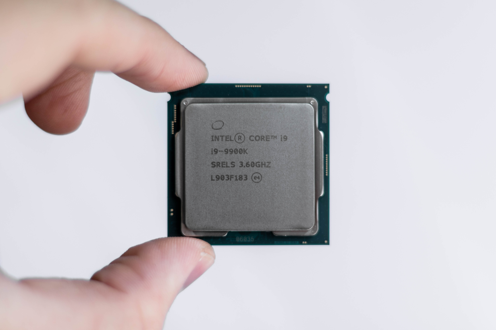

# 以太坊虚拟机
## 什么是虚拟机？
“EVM”代表“以太坊虚拟机”。虚拟机是运行任意指令的程序。然而，虚拟机与“普通”程序的不同之处在于它试图模拟一个实际的、物理的机器。

那究竟是什么意思呢？为了回答这个问题，首先让我们谈谈物理机器。

### 物理机器
“物理机器”通常指的是CPU - 计算机的中央处理器。这是一块实际存在于您的计算机（台式机、笔记本电脑、手机等）中的物理芯片，是您的计算机执行最多实际工作的部分。它是您的计算机进行计算的方式。

它可能长这样：

几十年来，中央处理器（CPU）一直在速度方面进行了高度优化。它们可以快速执行指令-每秒数万亿次。这是非常多的指令。

相比之下，以太坊虚拟机（EVM）并没有设计用于高吞吐量。由于燃气成本的限制，在交易中执行的指令数量远远无法达到这个数量级。

### 虚拟机
虚拟机是一个被设计成像物理机器一样运行的软件程序。也就是说，它是一种软件，类似于CPU，能够读取、解释和执行指令。

以太坊虚拟机也不例外。它会读取、解释和执行智能合约的字节码中编码的指令。执行这些指令的具体结果是更新合约状态并返回数据。

## 什么是指令？
指令是您希望机器执行的任务。每个指令都是一个小的低级任务。

例如，没有针对高级任务（如“进行网络调用”或“监听此按键”）的指令。相反，您只能访问一些诸如“将这两个数字相加”、“移动这些位”、“将这个值写入内存”等任务。

在大多数平台上，指令的结构通常包括：

    opcode + arguments

操作码是你想要执行的任务，而参数是你想要执行该任务所需的相关数据。

但是，这两个部分实际上是什么样的呢？让我们来检查和学习每个部分。

### 操作码
首先，机器是以二进制进行操作的。您发送给CPU的任何指令都将以预定格式的0和1发送。

什么格式？这取决于平台！由于我们正在讨论EVM，让我们立即解密一个操作码：

下面是两个数字相加的操作码示例：
- `00000001`

没错，它只是8个二进制数字-也就是8位，也就是1字节。这就是整个EVM操作码的全部内容。

但事实证明，对于人类来说，阅读二进制并不那么有趣。在我们的工作中，我们将上述内容重写为十六进制。以下是两个示例，展示了如何进行转换：

        00000001  - ADD opcode (binary)
    => 0000 0001
    =>    0    1
    =>      0x01  - ADD opcode (hex)

        11111101  - REVERT opcode (binary)
    => 1111 1101
    =>    F    D
    =>      0xFD  - REVERT opcode (hex)

这篇文章更容易阅读；它让我们避免了计算和计算哪些位是哪些值，并且可以直接阅读十六进制数字和字母。

> 0x前缀代表十六进制。你可能会在很多协议的名称中看到这个前缀（比如0xMacro，0xSplits等），即使从技术上讲它并不是十六进制。
> 
> 这是因为在web3领域，公司通常会这样做，因此它成为与web3行业相关联的标志。

就是这样！你刚刚学会了EVM操作码的全部内容：单个字节的数据。

### 操作码参数
你可能会想，“但参数呢？”。

让我们再次以ADD为例。虽然有些平台要求你指定两个数字的位置（例如寄存器），但在EVM上，参数是从栈中隐式获取的。

我们将在🧱与栈一起工作中学习这是如何工作的。

## 虚拟机的操作码
那么这与机器与虚拟机以及EVM有什么关系呢？简单总结一下：

虚拟机是一个行为类似于硬件CPU的软件程序。
EVM是一种虚拟机（因此得名）。
因此，EVM通过操作码执行指令，就像硬件机器一样。

## 二进制作为程序
EVM如何执行二进制？

从概念上讲，你可以将执行分为三个部分：

1. 字节码。
- 这是将要执行的程序。它可能看起来像这样：`0x62020f0960405260206040f3`
- 它主要由操作码组成。例如，0x62是PUSH3操作码。
- 一些操作码需要字面参数，这也是字节码的一部分。例如，在0x62020f09中，第一个字节（0x62）是PUSH3操作码，它读取下一个3个字节作为它的参数（0x020f09）。

2. 程序计数器。
- 这是当前运行操作码的位置。
- 程序计数器从零开始（最左边的字节），并在每个操作码执行后递增（向右移动）。
    - 这类似于字符串的索引。
    - 具有字面参数的操作码将使程序计数器超出其参数。例如，执行PUSH32将使程序计数器增加 33 个字节。
    - JUMP和JUMPI操作码允许你将程序计数器直接设置为JUMPDEST操作码的任何位置。

3. 执行环境。
- 这包括栈、内存、合约存储、调用数据和有关正在运行的交易的各种字段。
- 操作码在执行时操作栈、内存和存储。
- 你将在🧱执行环境中了解更多信息。

### 尽可能长时间运行
你应该了解的一个重要点是，当给定字节码运行时，EVM会尽可能长时间地运行它。

换句话说，当执行字节码时，EVM将第一个字节视为操作码，然后运行下一个字节作为操作码，然后是下一个字节，以此类推。

它会一直这样做，直到发生以下情况之一：
1. 字节码返回一个值（通过RETURN操作码）。
2. 字节码简单地停止执行（通过STOP操作码）。
3. 字节码崩溃，例如达到无效操作码。
4. 程序计数器达到字节码的末尾（很少发生）。
5. 执行环境的燃料用尽。

由于最后一个原因，EVM的执行保证会停止。即使是无限循环也会最终停止，因为燃料总是有限的。

还要注意，执行不一定总是严格从左到右；JUMP和JUMPI操作码允许程序计数器跳转到字节码的任何其他部分，只要目标字节是JUMPDEST字节。

### 字节码执行示例
下面是带有程序计数器的EVM执行示例。为了简单起见，这个可视化图中省略了执行环境的其他部分（栈、内存、存储、燃料）-我们将在以后的章节中介绍这些细节。