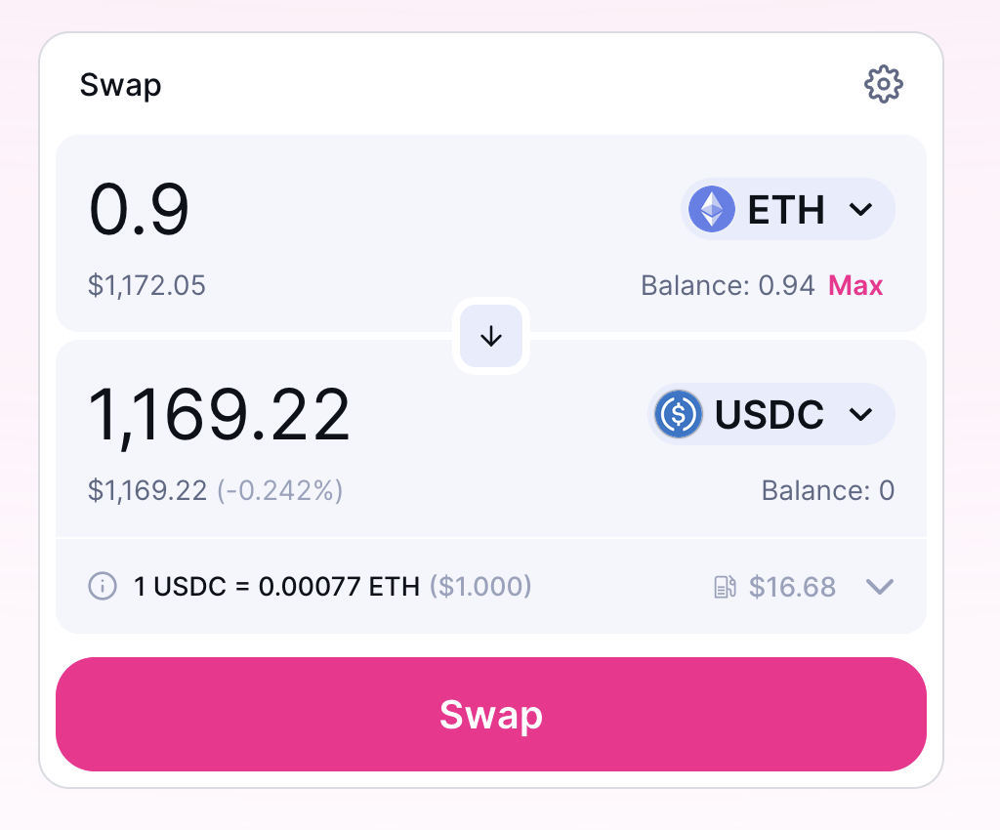
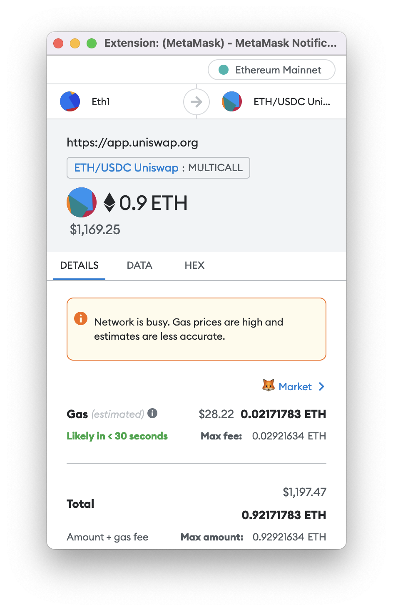
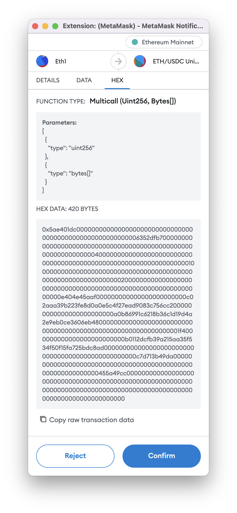

# 为什么要学习ABI编码？
无论您是否意识到，应用二进制接口（ABI）在智能合约和典型的以太坊交易的内部工作中都被广泛使用。作为一个Solidity / EVM开发者，您将不可避免地遇到奇怪和不寻常的情况，而对ABI的扎实知识将引导您解决面临的障碍。

简而言之，ABI在合约需要响应函数调用的任何时候都会被使用。

可以想象，这种情况非常常见。让我们探讨一下ABI被使用的常见情况：
- 交易数据
- 合约对合约的函数调用
- Hardhat和前端应用程序
- 智能合约设计模式

## 交易数据
每当您使用钱包在链上调用合约函数时，您都会发送一个ABI编码的函数调用。

一个常见的使用ABI编码的交易数据的例子是在Uniswap上进行交易。假设您想要用ETH交换USDC。您可以：

访问交换页面的Web前端并连接您的钱包。
选择ETH和USDC，输入金额，然后点击“Swap”：

点击该按钮后，页面的JavaScript会准备一个ABI编码的函数选择器和参数，并通过例如MetaMask的方式提示您创建并发送一个带有该ABI编码数据作为交易数据字段的交易，以发送到您用于交易的合约。

为了继续这个例子，让我们看一下这个数据是什么样子的，在未来的章节中我们将学习编码算法本身的细节。

以下是在点击“确认交换”按钮后MetaMask提示框可能看起来的屏幕截图：

请注意HEX选项卡 - 这是我们接下来要看的内容：

看到那个HEX DATA: 420 BYTES字段了吗？这就是ABI编码数据的样子！现在可能看起来有些可怕，但是在完成接下来的几章之后，您将对这些数据的真正作用有一个牢固的理解。

## 合约对合约的函数调用
我们刚刚看到的HEX DATA与合约之间在链上进行交互时使用的数据格式完全相同。

具体而言，每当您在Solidity中看到一个外部函数调用时：

    uint result = someExternalContract.foo(10);

这个调用会编译成以下代码：
1. 构造一个ABI编码的消息（即函数选择器+参数），
2. 使用CALL操作码将该消息发送到someExternalContract地址。
3. 位于someExternalContract地址处的合约字节码会解释该调用，对传入的消息进行ABI解码，运行自己的逻辑，并最终进行ABI编码以返回一个返回值。
4. 调用合约接收到返回值后，会进行ABI解码，并继续执行。

以下是与上述代码片段大致等效的一些Solidity代码：

    // 这段Solidity代码：
    //
    //    uint result = someExternalContract.foo(10);
    //
    // 大致等效于以下代码：
    //
    (bool success, bytes memory returnData)
      = someExternalContract.call(abi.encodeWithSignature('foo(uint256)', [10]));

    require(success, "foo failed");

    (uint result) = abi.decode(returnData, (uint));

我们还可以讨论更多细节，但是我们将在此处停止并继续前进，因为这只是入门的“为什么我应该学习这个？”课程 🙂

## Hardhat和前端应用程序
无论是Hardhat还是前端应用程序都使用ethers.js或类似的库。该库允许您编写类似于以下代码的JavaScript代码：

await greeterContract.setGreeting("Hello!");
这很好，但是ethers.js如何知道这个函数应该做什么？这是因为在编译过程中生成了合约的ABI声明。

例如，当您使用Hardhat编译Solidity时，Hardhat会生成类似以下的JSON文件：

